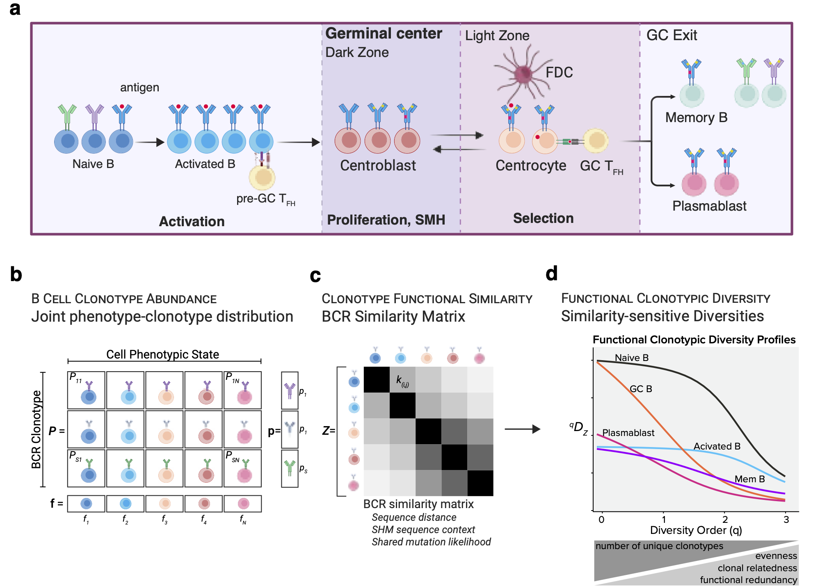

# BCRi

Tools for exploring the interplay between B cell receptor (BCR) sequence diversity and cellular phenotypes at single-cell resolution.

## Overview

The BCRi toolset incorporates adaptive immune receptor repertoire (AIRR) data at single-cell resolution that has been annotated for cell state or any other phenotypic covariate of interest. BCRi then constructs the repertoire-phenotype joint distribution in which each row corresponds to a distinct BCR sequence—by default, the sequence encoding the VDJ heavy chain—and each column represents a cell phenotype. A symmetric similarity matrix `k` defines the relationship between all pairs of BCR sequences; in the simplest case, `k` is the identity matrix spanning the `n` unique sequences.



**BCRi integrates B cell phenotypic states, clonotype abundances, and clonal lineage relationships to
provide a unified functional diversity framework that charts stages of B cell repertoire development.**
**a)** Ilustration of mature B cell phenotypic states and their contribitions to immunoglobulin affinity maturation
through clonal expansion of activated B cells and successive rounds of diversitification and selection in
germinal centers. **b)** Illustration of the joint distribution of cell phenotype and clonotype derived from single
cell RNA+VDJ sequencing datasets, with rows of clonotypes that represent unique BCR sequences, and
columns of phenotypic states, defined by gene expression. **c)** Functional similarity between clonotypes is
captured by a similarity matrix Z, which incorporates Hamming distance, somatic hypermutation (SHM)
sequence context, and likelihood of shared mutations for all pairs of clonotypes. **d)** BCRi formalizes a metric
termed effective functional clonotypic diversity, qDZ, where the viewpoint parameter q denotes diversity
order and calculating qDZ across a range of q values generates a diversity profile that reveals how repertoire
structure changes with increasing emphasis on abundant or functionally redundant clonotypes. At any value
of q, the resulting diversity can be interpreted as the effective number of functionally distinct BCRs. Diversity
profile plot of human tonsillar B cells using single cell RNA+VDJ data from King et al.

BCRi leverages an information theoretic framework applied to these data structures to quantify relationships between cell phenotype and immune repertoire. The package formalizes repertoire diversity metrics based on Shannon entropy that capture both varying abundances of BCR clonotypes and clonal families, as well as the varying sequence similarity at single-cell resolution.

## Key Features

- Construct repertoire–phenotype joint distributions directly from annotated single-cell AIRR datasets.
- Quantify diversity with Shannon entropy-based metrics that incorporate sequence similarity.
- Compute similarity-sensitive diversity profiles, meta-diversity summaries, and bootstrap-supported uncertainty estimates.
- Integrate seamlessly with Seurat metadata through helper utilities like `functional_diversity_from_seurat()`.
- Extend analyses with customizable affinity matrices and phenotype groupings.

## Installation

Install the development version from GitHub with `remotes` (or `devtools`):

```r
install.packages("remotes")
remotes::install_github("DoaneAS/BCRi")
```

Alternatively, clone the repository and install from source:

```r
git clone https://github.com/DoaneAS/BCRi.git
setwd("BCRi")
devtools::install()
```

## Getting Started

```r
library(BCRi)
data(db)
# Example: run diversity analysis on a prepared AIRR data.frame
diversity_metrics <- functional_diversity(
  db = airr_table,
  groupID = "clone_001",
  phenotype_var = "subset",
  group = "subject_id"
)

 diversity_metrics <- functional_diversity(
  db = db, 
  groupID = "BCP5", 
  cell_id = "cell_id", 
  phenotype_var = "CellPhenoGCs", 
  similarity = TRUE, 
  distanceCutoff = FALSE, 
  discreteVar = "clone_id")


# Example: compute diversity directly from a Seurat object
diversity_from_seurat <- functional_diversity_from_seurat(
  seurat_obj = seurat_object,
  groupID = "BCP5", 
  cell_id = "cell_id", 
  phenotype_var = "CellPhenoGCs", 
  similarity = TRUE, 
  distanceCutoff = FALSE, 
  discreteVar = "clone_id"
)
```

## Documentation

- Function reference: see the `man/` directory or run `help(package = "BCRi")` after installation.
- Tutorials and vignettes: forthcoming. Contributions and suggestions are welcome—feel free to open an issue or submit a pull request.

## Contributing

1. Fork the repository and create a feature branch.
2. Make your changes, adding tests and documentation when appropriate.
3. Submit a pull request describing the motivation and approach.

Please follow the existing code style and include reproducible examples when reporting issues.

## License

MIT License

Copyright (c) 2025 Ashley S Doane

Permission is hereby granted, free of charge, to any person obtaining a copy
of this software and associated documentation files (the "Software"), to deal
in the Software without restriction, including without limitation the rights
to use, copy, modify, merge, publish, distribute, sublicense, and/or sell
copies of the Software, and to permit persons to whom the Software is
furnished to do so, subject to the following conditions:

The above copyright notice and this permission notice shall be included in all
copies or substantial portions of the Software.

THE SOFTWARE IS PROVIDED "AS IS", WITHOUT WARRANTY OF ANY KIND, EXPRESS OR
IMPLIED, INCLUDING BUT NOT LIMITED TO THE WARRANTIES OF MERCHANTABILITY,
FITNESS FOR A PARTICULAR PURPOSE AND NONINFRINGEMENT. IN NO EVENT SHALL THE
AUTHORS OR COPYRIGHT HOLDERS BE LIABLE FOR ANY CLAIM, DAMAGES OR OTHER
LIABILITY, WHETHER IN AN ACTION OF CONTRACT, TORT OR OTHERWISE, ARISING FROM,
OUT OF OR IN CONNECTION WITH THE SOFTWARE OR THE USE OR OTHER DEALINGS IN THE
SOFTWARE.
